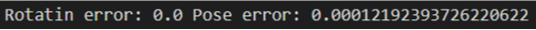
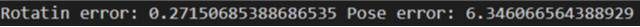
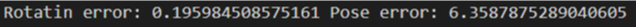
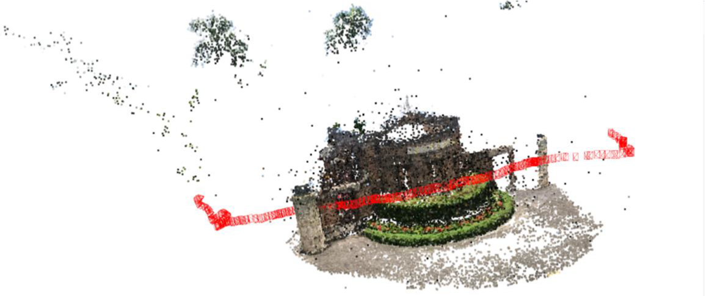
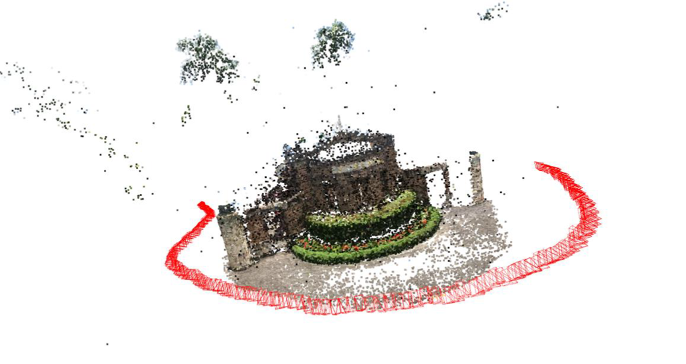
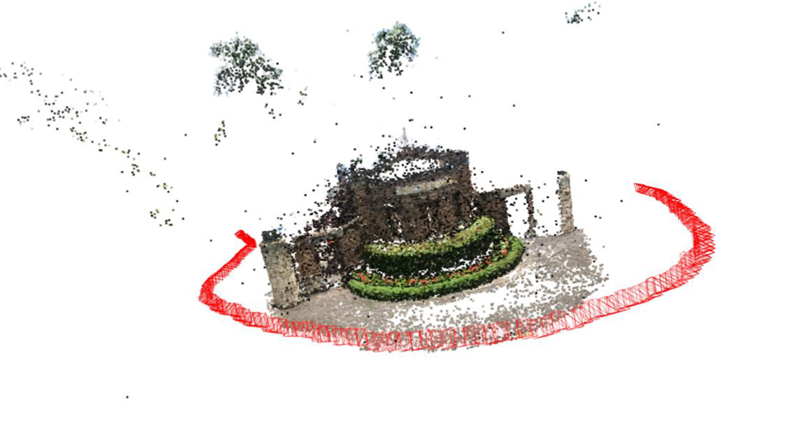
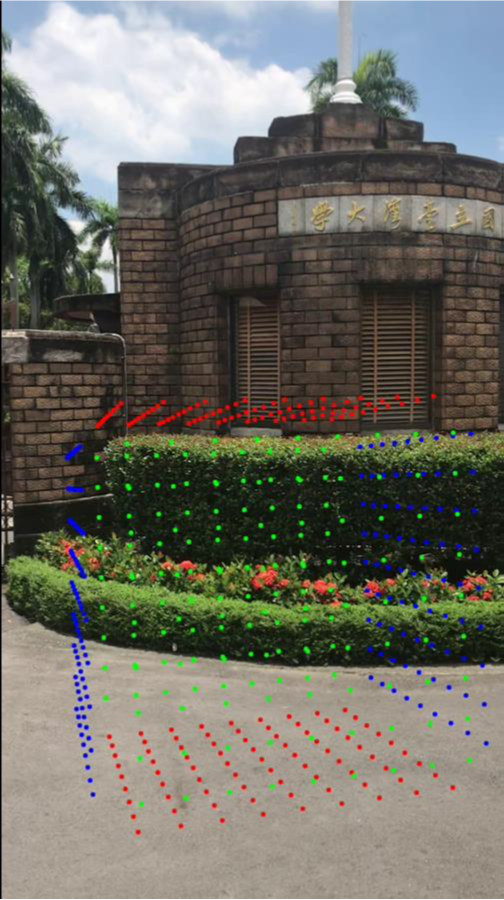

# Camera Pose Estimation

Dataset: [Download](https://drive.google.com/u/0/uc?export=download&confirm=qrVw&id=1GrCpYJFc8IZM_Uiisq6e8UxwVMFvr4AJ)

## 1. 2D-3D Matching
### 1.1 Implementation

```
Algorithm: Cpmpute Camera Extrinsic Matrix
Input: camera K, 3D points and its descriptor, 2D points and its descriptor, distorted coefficient
Output: rotation matrix, translation vector

matching pair by desciptors of 3D points and 2D points
...

rotation matrix, translation vector = RansacP3P(points2D, points3D, K, distCoeff)

Return rotation matrix, translation vector
```

```
Algorithm RansacP3P

Input: camera K, 3D points 2D points matching pairs, distCoeff
Output: Best rotation matrix, Best translation vector

N = log((1-0.99))/log(1-(1-0.5)**3)

For N times
   random sample 4 pairs from the whole 2D points 
   
   undistorted 2D points from distCoeff

   Try:
    estimated rotation matrix, estimated translation vector = P3P(points3D, points2D, K)

    compute the reprojected error according to the estimated rotation matrix and estimated translation vector

    record the number of outliers (error > 10)

    If outliers < min_outlier
        change min_outlier, R and T into current outliers, R and T
    
   except:
    print("No solution")
   
Return best fit rotation matrix, best fit translation vector
```

```
Algorithm P3P

Input: 3D points 2D points matching pairs, camera K
Output: estimated rotation matrix, estimated translation vector

transform 2D image points from image coordinate sys to camera coordinate sys

compute G0 G1 G2 G3 G4 from intrinsic matrix

find the root

compute y, a, b and c

trilateration

calculate lambda and R

use 4th point to determine best result
```

### 1.2 Error

The error was evaluated using the median absolute error. The results indicated that when distortion correction was applied, the translation error was lower compared to the non-distorted case. However, the rotation error was higher with distortion correction. Nevertheless, since the rotation error was within an acceptable range of less than 1 pixel, the distortion correction for 2D images still yielded better overall results.

OpenCV



MySelf (with undistortImg)



MySelf (without undistortImg)



### 1.3 Trajectory
To represent the camera in 3D space, I projected the four corner coordinates of the camera (0,0), (1080,0), (1080,1920), and (0,1920) based on the R and T matrices of each frame's image. The camera's center position was determined using the values from the T vector. Finally, connecting these five spatial coordinates with lines formed the camera model.

OpenCV



MySelf (with undistortImg)



MySelf (without undistortImg)




## 2. Augmented Reality
### 2.1 Virtual cube [AR Video Link](https://youtube.com/shorts/jE_7eRiB5UI?feature=share)

To execute this task, you need to first run the code for Q1 to generate "myRotation.npy" and "myTranslation.npy" files. The cube points are generated equidistantly on each face, and opposite faces have the same color. Then, using the camera positions from each valid photo, the distances are sorted from closest to farthest. It is crucial to ensure that the valid photo numbers match the input R and t data to correctly associate the R and t values with the corresponding images. Otherwise, incorrect R and t values might be obtained.

Cube in video



## 3. Build Environment
```
conda create --name camera_pose_p3p python=3.8
conda activate camera_pose_p3p
pip install -r requirements.txt
```

## 4. How to run my code
### 4.1 Problem 1
```
## running reproduce code
python 2d3dmatching.py --mode myself

## Running opencv code
python 2d3dmatching.py --mode opencv
```

### 4.2 Problem 2
```
python plotCube.py
```